# Assignment 1 – Radio Network Node (RN) CubeSat

## Mission Overview

The Radio Network Node (RN) mission deploys a 3U CubeSat in Low Earth Orbit (LEO) at 450–600 km altitude. The satellite acts as a store-and-forward communications relay: it receives radio messages from ground users or remote sensors, stores them onboard, and forwards them to a ground station during scheduled downlink passes. The expected operational lifetime is 18–36 months. The satellite operates largely autonomously, with ground contact limited to approximately 2–4 short passes per day.

---

## 1. Stakeholders


This diagram lists all stakeholder actors identified from the nine mission memos. The following eight stakeholder groups were identified:

- **University Research Consortium** – the program owner; requires repeatable, cost-effective missions using COTS components
- **Ground Operators** – operate the satellite day-to-day; require telemetry, commanding, software updates, and radio configuration
- **Development Team** – responsible for system design and architecture; sets engineering assumptions and models
- **Payload Teams** – interface with the satellite bus; require a standardised mechanical and electrical payload interface
- **Launch Broker** – enforces launch safety; requires deployment inhibits, no protrusions during launch, and delayed RF activation
- **Remote Sensors** – field-deployed devices that send relay messages to the satellite
- **International Telecommunication Union (ITU)** – regulatory authority for radio frequency licensing and compliance
- **Users** – end recipients of the relay service; require reliable, frequent message delivery

---

## 2. System Context – BDD


The BDD of the System Context establishes the system boundary by defining the `System Context` block and its parts. The identification of the surrounding elements of the system(can be seen on the diagram as Satellite) was based on the Mission Context documentation and the memos and communication excerpts contaoined within. The surrounding context elements are composed into the System Context as parts:

- **Ground Station** (`gs`) – terrestrial facility for commanding, telemetry reception, and data downlink. The Ground Operators(seen on the diagram as `Operators`) were earlier identified as important stakeholders in the project, and they interact with the System through these Ground Stations.
- **Remote Sensors/Ground Users** (`rs`) – field devices and users that uplink relay messages. Obviusly these are the `Users` and the `Remote Sensors` are the same as the stakeholders. They are part of the context as they interact directly with the satellite.
- **Launch Vehicle** (`lv`) – the carrier rocket and deployer mechanism. 
- **Environment** – decomposed into `Atmosphere`, `Earth`, and `Sun`, representing the physical environment. The elements highlighted as parts of the environment  were chosen for the following reasons: 
  - The satellite will be orbiting inside of the Atmosphere, the Exosphere to be exact, and due to the conditions present here (that also get mentioned in the assignment) the system will have to implement specialized heat regulation procedures.
  - The satellite will be orbiting around the Earth, and interacting with it's magnetosphere.
  - The satellite will be solar powered. Also the heating effects of prolonged exposure to solar radiaton will affect how the satellite operates.

This BDD makes the system boundary explicit and serves as the basis for the IBD interface definitions.

---

## 3. System Context – IBD


The IBD shows how the `Satellite` interacts with the context elements, throught clearly defined information flows.

- **Radio messages** (`«itemFlow»`, `rs` → `sat`, via antenna port) – relay uplink from ground users and sensors
- **instructions** (`«itemFlow»`, `gs` → `sat`, via antenna port) – authenticated commands from ground operators
- **Telemetry** (`«itemFlow»`, `sat` → `gs`, via antenna port) – periodic health beacon and status data
- **Solar Radiation** (`«itemFlow»`, `sun` → `sat`, via solar cells port) – primary energy input from the Sun
- **gravity** (`«itemFlow»`, `ea` → `sat`) – orbital force from Earth defining the LEO trajectory
- **drag** (`«itemFlow»`, `atm` → `sat`) – atmospheric drag acting as the passive deorbit mechanism at end of life
- **Mechanical Separation** (`lv` → `sat`) – physical deployment from the launch vehicle deployer

The use of `«itemFlow»` makes the nature and direction of each exchange explicit and traceable to requirements.

---

## 4. Requirements


Requirements were derived from the nine stakeholder memos and organised into six categories. After the id there is a short summary of the requirement, some explanaiton on why they exist and with quotations from the memos and engineering comments that they were based on. The categories and key requirements are:

**Functional**

- REQ1 – Radio Relay Service: the system shall relay messages from ground users to radio ground stations. This is the main functional requirement. The goal of the project is to enable the users to send messages to each other, and the collection of data from remote sensors. Every other function, be that telemetry or the specifics of operations, is subservient to this. Excerpt from the radio network user meeting: "*Users expect the satellite to listen frequently enough to be useful.*"
- REQ1.1 – Telemetry Service: the spacecraft shall transmit health information to ground operators. One can only maintain a satellite, or any system for that matter, if they have up-to-date information on the status(operational capabilites, component health, etc.) of it. In our case, this means frequent and punctual broadcasts of telemetry by the satellite. This was requested by the ground operators: "*We need regular status information so we know whether the spacecraft is alive.*"
- REQ1.2 – Store-and-Forward Message Handling: the system shall store messages until they can be downlinked. The satellite can't magically forward any message anywhere at any time, even if conditions are ideal, as the recipiant might not be in range. This naturally means that for messages to be delivered,user and telemetry both, they need to be stored on-board for a time: "*Weather or operational issues may prevent successful downlink for up to 72 hours. Persistent onboard storage should therefore be sized to accommodate multiple days of accumulated traffic, including operational logs.*"
- REQ1.3 – Configurable Radio Parameters: the system shall provide configurable transmission parameters. Allocated frequencies may change during the satellite's lifetime, along with user or operator expectations, and they may do so relatively frequently. "*Radio parameters (transmission frequency within licensed allocations, transmit power level, beacon interval, and data rate) must be configurable via commanding.*"
- REQ1.4 – Commandable Operations: the system shall accept and execute commands from ground operators. This is closely related to the previous requirement. However, this is a more general commanding, including mainly payload switching. "*Operators also asked whether payload power could be switched remotely.*"
- REQ1.5 – Payload Interface Services: the system shall provide electrical and data interfaces to support onboard payloads. The system design will be reused later for different payloads. This means that the payload can't be integrated closely onto the satellite. "*Payload interface should provide standard power rails and data link (e.g., serial/CAN-like).*"

**Performance**

These are the requirements that govern how well the system is expected to perform it's functions.
- REQ2 – Ground Contact Utilisation: 2–4 passes per day, 5–10 minutes each is the expected amount of time that can be used for downlinking. The satellite is expected to be able to perform all the necessary briadcasting to the ground stations during this time."*Ground communication opportunities are limited; assuming approximately three ground station passes per day with 5–10 minutes of usable link time per pass is reasonable.*"
- REQ3 – Receiver Duty Cycle: 10–50% of each orbital period is the reasonable expected up-time for recieving of user messagees, considering power constraints. "*assuming a 10–50 % receiver duty cycle is reasonable*" 
- REQ4 – Message Retention Capacity: sufficient storage for at least 72 hours of accumulated traffic. "*up to 72 hours. Persistent onboard storage should therefore be sized to accommodate*"
- REQ5 – Power Budget Compliance: operation within a power budget accounting for a 95-minute orbit with 30–40 minutes of eclipse. The satellite obviously can't get power from the solar panels when the Sun is eclipsed by the Earth. Battery capacity needs to be managed according to eclipse duration. "*Eclipse duration assumption ≈ 30–40 minutes/orbit. Targeted orbit takes 95 minutes. Power prioritization and budgeting required.*"
- REQ6 – Volume and Form Factor Compliance: standard 3U CubeSat form factor (10 × 10 × 34 cm)

**Security**
- REQ7 – Command Authentication: all commands shall be authenticated before execution. "*We want some form of authentication and a record of what was sent.*"

**Safety**
- REQ8 – End-of-Life Passivation: transmitters disabled and battery passivated at end of life. Responsible end of life behaviour is expected. It is important to minimize orbital debris and to not have a noise generator stay in orbit."*End-of-life behavior includes transmitter shutdown and battery passivation.*"
- REQ9 – Launch and Deployment Inhibits: multiple independent inhibits to prevent premature activation. The satellite activating before it should wouldn't just mean the failure of our mission, but could potentially ruin the entire launch, including all the other payloads on the rocket. "*Multiple deployment inhibits expected (mechanical switch + timer or software condition).*"
- REQ9.1 – Delayed Deployables: deployable elements stowed until after deployment confirmation. These deploying would damage the satellite and other surrounding payloads. "*No protrusions during launch; deployables allowed afterward.*"
- REQ9.2 – Delayed RF Activation: radio transmission delayed for a defined period after deployment. "*RF transmission activation delayed after deployment (timer on the order of tens of minutes).*"

**Reliability**
- REQ11 – Safe Mode: a protective mode that prioritises survival and basic communications. Solar events and other distruptive happenings may occur. "*There should be a conservative configuration in which the spacecraft focuses solely on survival and communication with Earth.*"
- REQ11 – Temperature Protection: safeguards to keep the system within operational temperature limits
- REQ12 – Battery Deep Discharge Protection: protection against deep discharge events. These could end the mission by themselves. *Deep battery discharge causes permanent damage.*"
- REQ13 – Fault Detection and Recovery: watchdog-based reset and fault recovery strategies. Radiaton can, and therefore will, impact computation. This shouldn't end the mission. "*Radiation resets expected → watchdog/reset recovery typical.*"
- REQ14 – Software Update Recovery: automatic rollback to a working configuration if an update fails. A failed software update shouldn't brick our entire system. "*Software update recovery/fallback mechanism expected.*"

**Usability / Supportability**
- REQ15 – Payload Power Switching: remote power switching of payload by the onboard computer. Mostly for troubleshooting. "*Operators also asked whether payload power could be switched remotely. That would simplify troubleshooting experiments behaving unexpectedly.*"
- REQ16 – Autonomous Operation Between Ground Contacts: autonomous operation without continuous supervision. The satellite should autonomously position itself so the solar panels get the most sunlight, the broadcasts go in the right direction etc. "*The satellite must function largely autonomously because communication opportunities with ground operators are limited...*"
- REQ17 – Command Traceability: the system shall record logs of received and executed commands. We want to know who sent what command, so responsibility(or blame rather) can be assigned after investigation. "*We want some form of authentication and a record of what was sent.*"
- REQ18 – Software Update: support for remote software updates. Improvements may be discovered after launch. "*Software updates are expected during the mission.*"
- REQ19 – Use Commercial CubeSat Modules: COTS subsystems preferred. Makes our job easier, as compatibility and support is agiven. "- *Prefer commercially available CubeSat subsystems (OBC, EPS, radios, sensors).*"

**Economic constraints**
- REQ20 – Total Hardware Budget: total hardware cost on the order of €200k. ("*Assume total hardware budget ≈ €200k (order of magnitude).*")
- REQ21 – Subsystem Cost Range: subsystem costs typically €5k–€40k. "*Typical subsystem cost range ≈ €5k–€40k.*"
---

## 5. Use Cases


The Use Case diagram captures the satellite's externally observable behaviours. 

**Actors and their use cases:**
- **Launch Broker** → *Survive launch and deployment*: covers deployment inhibits, mechanical separation, and delayed RF activation.

**Basic path**

| Step  | Action | Results |
| ----- | ------------- | - |
|   1   | Ascent with spacecraft stowed in deployer; launch inhibits active | In launch configuration; RF off |
|   2   | Deployer performs mechanical release / separation  |  Spacecraft separated from LV |
|   3   | Receive deployment confirmation from deployer (electrical signal) or validate backup timer per design  | Release condition satisfied |
|   4   | Release software deployment inhibits when rules allow (e.g. switch + timer + software gate) | Transition toward operational configuration |
|   5   | Start post-deployment delay timer before enabling active RF loads  | RF still inhibited |
|   6   | Wait until post-deployment delay elapses (tens of minutes)  | Delay complete |
|   7   | Allow transition to normal operational modes per mission rules (RF may be enabled per schedule) | Post-deploy ops state |

**Alternate path - Timer-only release**

| Step  | Action | Results |
| ----- | ------------- | - |
|   1   | Backup timer reaches validated threshold without valid deploy signal | Timer-based release condition is true per design |
|   2   | Onboard logic applies same inhibit-release rules as for signal path |  Spacecraft separated from LV |
|   3   |  Continue post-deployment delay before enabling RF | Same safe sequencing as main path |

**Exception path - TInvalid or missing deployment confirmation**

| Step  | Action | Results |
| ----- | ------------- | - |
|   1   | Deploy signal missing, inconsistent, or fails self-check | Release condition not satisfied |
|   2   | All deployment inhibits remain active | Spacecraft stays in launch-safe configuration |
|   3   |  Event flagged for review on next ground contact (documented policy) |  Operators can diagnose |

**Constraints**

| Constraint  | Type | Status |
| ------------- | ------------- | ------------- |
| Deployment confirmation signal or equivalent timer condition has been satisfied | Post-condition | Approved |
| RF transmission and non-essential loads are inhibited per launch configuration | Pre-condition | Approved |
| Spacecraft is stowed in the standard deployer with deployment inhibits active | Pre-condition | Approved |
| Transition to post-deployment configuration is allowed per inhibit rules; RF activation remains delayed per policy | Post-condition | Approved |

Below is the sequence diagram of the use case's happy path. 

- **Ground Operators** → *Perform software update*, *Send authenticated command*, *Configure radio parameters(shared with the ITU)*, *Receive telemetry*: all operational interactions with the satellite during ground passes.

**Perform software update:**

**Basic path**

| Step  | Action | Results |
| ----- | ------------- | - |
|   1   | Operator selects validated software image on ground | Update session started |
|   2   | Image uplinked in segments with acknowledgements | All segments received onboard |
|   3   | Spacecraft verifies integrity (and signature if applicable) | Image trusted |
|   4   | Spacecraft installs image and reboots if required | New bank staged or active |
|   5   | Post-boot health checks; status in telemetry | Health OK or failure flagged |
|   6   | Ground confirms operational state from telemetry | Update closed successfully |

**Alternate path - Corrupt or missing segment**

| Step  | Action | Results |
| ----- | ------------- | - |
|   1   | Segment fails CRC/sequence check | Onboard requests retransmission or aborts window |
|   2   | Ground retransmits segment or restarts transfer | Transfer continues or is abandoned after policy limit |
|   3   | No image activation until full image is valid | Previous software remains active |

**Excepiton path - Failed boot or health check on new image**

| Step  | Action | Results |
| ----- | ------------- | - |
|   1   | New image boots but fails mandatory health checks | Failure detected by watchdog / self-test |
|   2   | Automatic fallback to previous image bank executes |  Known-good software restored |
|   3   |   Telemetry reports active bank and fallback event |  Ground confirms recovery |

**Constraints**

| Constraint  | Type | Status |
| ------------- | ------------- | ------------- |
| Stable ground link suitable for image transfer | Pre-condition | Approved |
| Update package is integrity-checked on ground before uplink | Pre-condition | Approved |
| New software is active or fallback to previous image completed successfully | Post-condition | Approved |
| Health telemetry confirms boot state after update attempt | Post-condition | Approved |

Below is the activity diagram of the use case. It clearly models it with proper use of decisions and merges(where needed)

**Send authenticated command:**

**Basic path**

| Step  | Action | Results |
| ----- | ------------- | - |
|   1   |  Authorised operator prepares command with authentication fields | Command ready for uplink |
|   2   | Ground system authenticates operator and builds uplink frame | Frame ready; auth logged on ground |
|   3   | Ground station transmits command during visibility pass | Command on RF link |
|   4   | Spacecraft verifies authentication and validates syntax/permissions | Accept or reject decision made |
|   5   | Spacecraft executes command or rejects with reason code | Configuration or mode updated, or rejection |
|   6   | Ground logs command, auth result, and outcome | Traceability record complete |

**Alternate path - Authentication failure**

| Step  | Action | Results |
| ----- | ------------- | - |
|   1   | Ground or onboard authentication fails | Command is not accepted for execution |
|   2   | Ground discards frame and logs failure reason and operator id | Audit trail complete |
|   3   | No change to onboard configuration | Safe state preserved |

**Excepiton path - Link loss during uplink**

| Step  | Action | Results |
| ----- | ------------- | - |
|   1   | RF link drops before command is fully received | Partial or corrupted frame may arrive |
|   2   | Spacecraft rejects incomplete or invalid command per protocol | No partial execution |
|   3   | Operator retries with full command on a subsequent pass | Use case completes later |

**Constraints**

| Constraint  | Type | Status |
| ------------- | ------------- | ------------- |
| Ground link is available during a ground station pass | Pre-condition | Approved |
| Operator is authorised to send commands | Pre-condition | Approved |
| Command format and protocol version are valid | Pre-condition | Approved |
| Command is authenticated and execution outcome (accepted/rejected) is logged on ground | Post-condition | Approved |
| Spacecraft has applied the command or returned a documented rejection reason | Post-condition | Approved |

**Configure radio parameters:**

**Basic path**

| Step  | Action | Results |
| ----- | ------------- | - |
|   1   | Operator defines target parameters within licence limits | Valid target set |
|   2   | Authenticated configuration command uplinked | Command onboard |
|   3   | OBC/radio applies frequency, power, beacon interval, data rate if allowed | Config updated or rejected |
|   4   | Confirmation reflected in telemetry | Ground can verify |
|   5   | Change logged for traceability / regulatory record | Audit trail updated |

**Alternate – Parameter outside licence or policy**

| Step  | Action | Results |
| ----- | ------------- | - |
|   1   | Requested frequency, power, beacon interval, or rate violates limits | Onboard rejects apply |
|   2   | Configuration remains unchanged from last known good | Regulatory compliance preserved |
|   3   | Rejection and attempted values logged on ground |  Audit trail for regulator |

**Exception – Partial apply or apply fault**

| Step  | Action | Results |
| ----- | ------------- | - |
|   1   |  Apply sequence fails midway (hardware/software fault) | Inconsistent config detected |
|   2   |  Rollback to last known good radio profile per policy | Safe RF behaviour restored |
|   3   | Telemetry reports fault and rollback; operators notified | Recovery visible from ground |

**Constraints**

| Constraint  | Type | Status |
| ------------- | ------------- | ------------- |
| Requested parameters remain within licensed allocation | Pre-condition | Approved |
| Authorised command path is used (operator + authentication) | Pre-condition | Approved |
| Frequency, transmit power, beacon interval, and data rate reflect commanded values where allowed | Post-condition | Approved |
| Rejected illegal parameters leave configuration unchanged; event is logged | Post-condition | Approved |

**Receive telemetry:**

**Basic path**

| Step  | Action | Results |
| ----- | ------------- | - |
|   1   | Ground station acquires satellite during pass | Link up |
|   2   | Spacecraft transmits health beacon / telemetry | RF downlink carries status |
|   3   | Ground receives and decodes telemetry | Parameters available to operators |
|   4   | Operators review power, thermal, mode |  Operational awareness updated |
|   5   | CTelemetry archived in operations log | Record retained |

**Alternate – Beacon skipped for power saving**

| Step  | Action | Results |
| ----- | ------------- | - |
|   1   |  Spacecraft skips a scheduled beacon to conserve energy | No transmission in that slot |
|   2   | Next telemetry includes documented reason code for the skip | Operators understand why data is missing |
|   3   | Ground log records skip reason | Traceability maintained |

**Exception – Pass missed (weather / operations)**

| Step  | Action | Results |
| ----- | ------------- | - |
|   1   |  Ground station does not achieve usable link during scheduled pass | No new telemetry received |
|   2   |  Operations log records pass miss | Gap is explainable |
|   3   | Next successful pass restores fresh telemetry | Use case resumes on next attempt |

**Constraints**

| Constraint  | Type | Status |
| ------------- | ------------- | ------------- |
| Spacecraft is in a state allowed to transmit beacon/telemetry | Pre-condition | Approved |
| Ground station is in visibility and configured for the pass | Pre-condition | Approved |
| Operators received latest health/state information or documented skip reason | Post-condition | Approved |
| Telemetry record is stored on ground for traceability | Post-condition | Approved |

- **Remote Sensors** and **Users** → *Recieve relay message, includes Store relay message* , *Forward relay data*: the core relay up- and downlink from field devices and users.

**Recieve relay message:**

**Basic path**

| Step  | Action | Results |
| ----- | ------------- | - |
|   1   | User or remote sensor transmits short burst in agreed band | RF uplink from client |
|   2   | Receiver active per duty-cycle / schedule | Reception possible |
|   3   | Demodulate and validate frame | Valid payload extracted |
|   4   | Hand off payload to storage path | Ready for Store relay message |
|   5   | Update internal status / queue metadata | Scheduling/logging updated |

**Alternate – Frame validation failure (noise / collision)**

| Step  | Action | Results |
| ----- | ------------- | - |
|   1   |  Demodulation or CRC/frame check fails | Message not accepted |
|   2   | No handoff to storage; optional counter/log for diagnostics |  Queue unchanged |
|   3   | User or sensor may retry in a later listening window |  Service continues opportunistically |

**Exception – Receiver off (power / mode)**

| Step  | Action | Results |
| ----- | ------------- | - |
|   1   | Receiver inactive due to duty-cycle or safe mode | Uplink burst not received |
|   2   | Behaviour matches documented energy and mode policy | No silent undefined state |
|   3   | Next scheduled listen window may capture later retries | Use case deferred, not corrupted |

**Constraints**

| Constraint  | Type | Status |
| ------------- | ------------- | ------------- |
| Receiver is active per duty-cycle / scheduling policy | Pre-condition | Approved |
| User or sensor transmits in the agreed band and burst profile | Pre-condition | Approved |
| Valid message is passed to onboard storage path for persistence | Post-condition | Approved |
| Failed reception is handled without silent data loss beyond defined policy | Post-condition | Approved |

**Store relay message:**

**Basic path**

| Step  | Action | Results |
| ----- | ------------- | - |
|   1   |  Storage manager receives validated message from receive path | Message in handler |
|   2   | Run integrity check | Data trusted |
|   3   | Write message body and metadata (time, source id) to non-volatile store | Persisted |
|   4   | Update queue pointers for downlink ordering | Forward path can schedule |
|   5   | Notify downlink scheduler if applicable | Downlink queue consistent |

**Alternate – Storage threshold reached (near full)**

| Step  | Action | Results |
| ----- | ------------- | - |
|   1   | Free capacity below policy threshold | Store policy triggers |
|   2   | Apply documented rule: e.g. drop oldest, drop lowest priority, or reject new | Behaviour is deterministic |
|   3   | Policy event logged (onboard and/or next downlink) | Operators can verify |

**Exception – Storage write or media fault**

| Step  | Action | Results |
| ----- | ------------- | - |
|   1   | Write error or media fault detected | Data may be partially written or lost for that message |
|   2   | Enter safe handling per architecture (e.g. safe mode, relay paused) | Mission safety prioritised |
|   3   | Fault indicated in telemetry on next pass |  Ground can respond |

**Constraints**

| Constraint  | Type | Status |
| ------------- | ------------- | ------------- |
| Valid relay message available from receive path | Pre-condition | Approved |
| Storage has capacity or FIFO/eviction policy is defined (Memo I: multi-day backlog) | Pre-condition | Approved |
| Message and metadata are persisted; ordering is preserved per policy | Approved |
| Command is authenticated and execution outcome (accepted/rejected) is logged on ground | Post-condition | Approved |
| Message is retained until successful downlink or policy-based deletion | Post-condition | Approved |

**Forward relay data:**

**Basic path**

| Step  | Action | Results |
| ----- | ------------- | - |
|   1   | Scheduler selects queued messages for upcoming pass | Downlink set defined |
|   2   | Ground station establishes link during pass | Link usable |
|   3   | Downlink data at effective mission rate | Data on link |
|   4   | Ground acknowledges segments or complete transfer | Delivery confirmed |
|   5   | Remove or mark delivered messages; update logs | Queue consistent |
|   6   | Operators access received mission data on ground | Relay service completed for batch |

**Alternate – Extended period without successful downlink (e.g. up to 72 h)**

| Step  | Action | Results |
| ----- | ------------- | - |
|   1   |  Weather or operations prevent successful passes | No delivery in window |
|   2   | Queued messages and logs remain stored per sizing assumptions | No loss beyond defined policy |
|   3   | Transfer resumes when link returns | Same use case continues later |

**Exception – Link drop during transfer**

| Step  | Action | Results |
| ----- | ------------- | - |
|   1   | Downlink interrupted mid-transfer | Partial delivery may occur on ground |
|   2   | Onboard tracks last acknowledged offset or segment index | Resume possible |
|   3   | Remaining data sent on next pass; duplicates avoided per protocol | Consistent queue state |

**Constraints**

| Constraint  | Type | Status |
| ------------- | ------------- | ------------- |
| At least one queued message exists for downlink | Pre-condition | Approved |
| Ground pass with usable link time is available | Pre-condition | Approved |
| Ground station received data or partial transfer is logged for resume | Post-condition | Approved |
| Successfully delivered messages are removed or marked per retention policy | Post-condition | Approved |

- **International Telecommunication Union** → *Configure radio parameters(Shared with Ground Operators)*: regulatory compliance role ensuring radio parameters remain within licensed allocations.

---
## 7. Functional Model – BDD (Logical Architecture)


The Block Definition Diagram defines the logical decomposition of the satellite's functionality. The `CubeSat System Function` block is composed of six functional subsystems:
- **Deployment Management** – handles launch inhibit release and post-deployment sequencing
- **Telemetry & Health Monitoring** – generates periodic beacon and health data
- **Command & Control** – central coordination, mode management, watchdog, command authentication
- **Payload Data Management** – relay message reception, storage and queue management
- **Communication Management** – RF uplink/downlink and scheduling
- **Power Management** – solar charging, battery protection, load switching

Each block exposes typed ports that correspond to defined interfaces.

---
## 6. Functional Model – IBD (CubeSat System Function)


This Internal Block Diagram shows the interactions between the logical functional blocks inside the satellite. `Command & Control` acts as the central coordinator, connected to all other function blocks via typed ports and interfaces:
- **Telemetry Interface** → `Telemetry & Health Monitoring`
- **Communication Interface** → `Communication Management`
- **Payload Interface** → `Payload Data Management`
- **Power Management Interface** → `Power Management`
- **Deployment Management Interface** → `Deployment Management`

Ball-and-socket notation indicates provided (ball) and required (socket) interfaces, making the direction of service provision explicit.

---

## 8. Functions Package


This diagram provides a flat overview of all functional blocks defined in the Functions package. It shows each block's name, stereotype, and available ports independently of the composition hierarchy, serving as a reference for the port types used in IBD connections.

---

## 9. Interfaces Package


Six `«interface»` elements define the typed contracts between functional blocks:
- **Telemetry Interface** – carries temperature, velocity, and angular velocity signals
- **Control Interface** – carries control signals and inhibit release commands
- **Deployment Management Interface** – carries deployment confirmation signals
- **Communication Interface** – carries decoded messages and relay data for downlink
- **Payload Interface** – carries payload status signals
- **Power Management Interface** – carries power state and budget information

These interfaces ensure that functional connections are typed and verifiable, supporting the traceability requirement.

---

## 10. Interface–Port Realisation


This diagram shows the realisation relationships between port block types and their corresponding interfaces. Each port type (e.g., `Telemetry Port`, `Communication Port`, `Deployment Port`) is linked to its `«interface»` definition via a dashed realisation arrow. This formalises the type system used in the IBD connections and ensures that port compatibility can be checked for correctness and traceability.

---

## 11. Functional Model – Signals


This diagram defines the nine signal types used across the functional model interfaces. Signals correspond directly to the receptions declared in the functional interface definitions and serve as the typed payloads carried by item flows:

- **Control Signal** – commands and mode control directives issued by Command & Control
- **Decoded Messages** – relay messages received and decoded by the Communication Management function
- **Relay Data for Downlink** – buffered relay messages queued for transmission to the ground station
- **Deployment Signal** – confirmation signal from the deployment mechanism indicating satellite separation
- **Inhibit Release** – signal authorising the transition from launch-safe to operational configuration
- **Telemetry** – periodic health status data including power, thermal, and operational state
- **Payload Status** – status information reported by the Payload Data Management function
- **Power Status** – power budget and battery state information reported by Power Management
- **Incoming Radio Messages** – raw relay uplink messages received from ground users or remote sensors

These signal definitions enforce type discipline across all interface connections in the functional IBD.

---

## 12. Platform Model – Components


This package serves as the container for all platform component block definitions. It is intentionally kept separate from the BDD and IBD views to allow component definitions to be reused across multiple diagrams without duplication. The individual hardware blocks defined here are composed into the `CubeSat System Platform` block in the physical architecture BDD.

---

## 13. Platform Model – CubeSat System Platform (IBD)


This Internal Block Diagram shows the physical interconnections between all hardware components inside the `CubeSat System Platform`. Components are represented as parts with their exposed ports, connected via directed connectors corresponding to the CAN data bus and power distribution:

- **Speed Sensor** and **Temperature Sensor** connect to the **On Board Computer** via `Data: CAN Port`, supplying velocity and thermal measurement data respectively
- **Electrical Power Subsystem** distributes regulated power to all active components via `Power Port` connections
- **On Board Computer** connects to the **Radio Transceiver** via `Radio: CAN Port` for uplink and downlink scheduling
- **On Board Computer** connects to the **Antenna System** and **RN Payload Module** via `Antenna: CAN Port` and `Data: CAN Port` respectively
- **Radio Transceiver** connects to the **Antenna System** via `Radio: CAN Port` for RF transmission and reception
- **RN Payload Module** connects to the **Antenna System** for relay message reception

The CAN bus topology reflects the use of commercially available CubeSat bus components in a shared communication architecture. Power connections originate from the EPS and reach all subsystems.

---

## 14. Platform Model – Electrical Power Subsystem (IBD)


This Internal Block Diagram details the internal structure of the `Electrical Power Subsystem`, which is decomposed into three hardware parts:

- **Solar Panels** – primary energy source; generate power during sunlit orbital phases (~30–35 minutes of a 95-minute orbit are eclipse, leaving ~60–65 minutes of solar generation time per orbit)
- **Battery Pack** – energy storage for eclipse operation; protected against deep discharge (Discharge Limit: 20% SoC)
- **Power Supply** – the central power conditioning unit that regulates input from the solar panels, manages battery charge and discharge, and distributes regulated power to the platform via the `Power Output` port; also receives `Battery Control: CAN Port` commands from the On Board Computer for load management and power prioritisation

The `Battery Control: CAN Port` on the EPS boundary allows the OBC to command the EPS remotely, enabling software-controlled load shedding and Safe Mode power reduction.

---

## 15. Platform Model – Interfaces


This diagram defines the interface contracts used in the platform model. Two interface types and their associated port blocks are defined:

- **CAN Interface** (`«interface»`) – the primary data communication interface used across the platform bus; receives `CanMessage(Header, Payload)` signals, representing the CAN frame structure. The `CAN Port` block type is defined to use this interface.
- **Wireless Interface** (`«interface»`) – models the radio-frequency deployment confirmation path; receives `Deployment Confirmation Signal` from the launch vehicle deployer. The `Wireless Connection` block type realises this interface.
- **Power Port** – a port block typed with a `«FlowProperty»` of `electricity`, representing the unidirectional power distribution between the EPS and consuming components.

These interface definitions ensure that all platform port connections are typed, making compatibility verifiable and supporting the traceability requirement from REQ25.1 (command authentication relies on authenticated CAN frames) and REQ10 (deployment inhibit via wireless confirmation signal).

---

## 16. Platform Model – Physical Architecture (BDD)


This Block Definition Diagram defines the complete physical component hierarchy of the satellite. The `CubeSat System Platform` block is the root composite, composed of seven first-level hardware subsystems:

- **On Board Computer** – central processing unit; ports: `Control: CAN Port`, `Radio: CAN Port`, `Power In: Power Port`, `Data: CAN Port`
- **Electrical Power Subsystem** – power generation, storage, and distribution; itself composed of three sub-parts:
  - **Battery Pack** – ports: `Power In: Power Port`, `Power Out: Power Port`
  - **Solar Panels** – port: `Power Out: Power Port`
  - **Power Supply** – ports: `Power Out: Power Port`, `Power In: Power Port`, `Battery Control: CAN Port`
- **Antenna System** – RF transceiver antenna; ports: `Power In: Power Port`, `Antenna: CAN Port`
- **RN Payload Module** – relay payload receiver and buffer; ports: `Antenna: CAN Port`, `Power Input Port`, `Data: CAN Port`, `Power In: Power Port`; value: `Storage_Capacity: byte = 20000`
- **Temperature Sensor** – thermal monitoring; ports: `Power In: Power Port`, `Data: CAN Port`
- **Speed Sensor** – angular rate / velocity monitoring; ports: `Data: CAN Port`, `Power In: Power Port`
- **Radio Transceiver** – TT&C and downlink radio; ports: `Power In: Power Port`, `Radio: CAN Port`

The EPS composition with inner `Power Supply`, `Battery Pack`, and `Solar Panels` reflects the instructor feedback that power generation and storage components should be explicitly modelled as EPS sub-parts rather than top-level platform components.

---

## 17. Platform Model – Signals


This diagram defines the signal and data types used in the platform-level interfaces and item flows:

- **CanMessage** (`«signal»`) – the CAN bus message format, parameterised with `Header` and `Payload` arguments; used by the CAN Interface
- **Payload** (`«block»`) – the data content of a CAN message, received via the `CanMessage` signal
- **Header** (`«block»`) – the addressing and control part of a CAN frame
- **Electricity** (`«block»`) – the flow type assigned to power port connections, representing electrical energy transfer
- **Float32** (`«ValueType»`) – floating-point value type used for analogue sensor readings (e.g., temperature, angular rate)
- **Int32** (`«ValueType»`) – integer value type used for discrete status values and counters
- **Deployment Confirmation Signal** (`«signal»`) – the wireless signal generated by the launch vehicle deployer upon satellite separation

These type definitions underpin the typed port connections in both the platform IBD and the EPS IBD, ensuring all data and power flows have explicit, model-checkable types.

---

## 18. System Architecture – Component Allocation

This diagram is the central system architecture view. It shows how the logical functional blocks defined in the Functional Model are **allocated** to the physical hardware components of the Platform Model via `«allocate»` dependency relationships.

The upper region depicts the **Functional Model** (`CubeSat System Function`) with its six functional parts and their interconnections. The lower region depicts the **Platform Model** (`CubeSat System Platform`) with the physical hardware components. `«allocate»` arrows cross from functional blocks downward to their implementing hardware:

| Functional Block | Allocated to Platform Component |
|---|---|
| Command & Control | On Board Computer |
| Telemetry & Health Monitoring | On Board Computer |
| Communication Management | Radio Transceiver + Antenna System |
| Payload Data Management | RN Payload Module + On Board Computer |
| Power Management | Electrical Power Subsystem |
| Deployment Management | On Board Computer (inhibit logic) + EPS (power gating) |

This allocation view satisfies the README checklist requirement for "functions allocated to platform elements" and provides the basis for the component-function IBD view. It also supports requirement traceability: each functional requirement can be traced through the functional block to the physical component responsible for its implementation.

---

## 19. System Architecture – Signal Allocation


This diagram is intended to capture the allocation of functional-level signals to platform-level physical signals, bridging the signal definitions in the Functional Model with those in the Platform Model. The two zones — `Functional` and `Platform Model` — represent the two signal namespaces. This view is currently under development; allocation relationships will be added as the signal-to-hardware mapping is refined in subsequent iterations.

---

## 20. Reliability Analysis – Fault Tree Analysis

Fault Tree Analysis (FTA) was applied to identify combinations of hardware faults, software errors, and operational errors that could lead to mission-critical top-level failure events. Four fault trees were constructed, each targeting a distinct failure domain. The analysis uses standard FTA notation: OR gates indicate that any single contributing cause is sufficient; AND gates indicate that all contributing causes must occur simultaneously.

---

### FT1 – Loss of Store-and-Forward (Relay) Function

Function.png)

**Top Event:** Loss of message relay capability — the satellite can no longer perform its primary mission function.

**Gate logic:** OR at the top level. The relay function depends on three independent subsystems in series (uplink → storage → downlink). Failure of any single subsystem is sufficient to break the relay chain, regardless of the health of the others.

**Subsystem Failure 1 – Uplink (Reception) failure** (OR gate):
- *Receiver hardware failure* — physical damage to the LNA or antenna structure, e.g., due to launch vibration or on-orbit radiation degradation
- *Improper duty cycle scheduling* — the receiver is inactive when an incoming transmission arrives; a realistic operational risk given the 10–50% receiver duty cycle (Assumption A1)

**Subsystem Failure 2 – On-board data storage failure** (OR gate):
- *Flash memory physical damage or SEU* — a Single Event Upset caused by cosmic radiation corrupts the non-volatile storage; a known risk in LEO over an 18–36 month mission lifetime
- *File system corruption* — unexpected power loss during a write operation corrupts the file system; directly motivates REQ12 (battery deep discharge protection) and the EPS safe-mode load-shedding design

**Subsystem Failure 3 – Downlink (Transmission) failure** (OR gate):
- *Transmitter hardware failure* — the RF transmitter circuit fails, preventing downlink
- *Lack of synchronisation with Ground Station* — the satellite transmits but the ground station is not in a receiving configuration; an operational scheduling risk given the limited ~3 passes/day contact window (Assumption A8)

---

### FT2 – Fatal Power System Failure

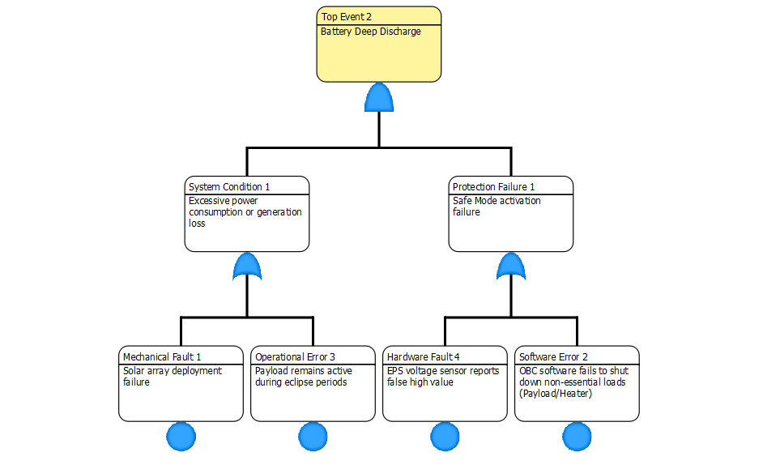

**Top Event:** Battery Deep Discharge — the battery is discharged below the 20% SoC limit (Assumption A10), causing permanent electrochemical damage and potential total loss of the spacecraft.

**Gate logic:** AND at the top level. Deep discharge can only occur if excessive power consumption or generation loss is present AND the protective Safe Mode mechanism also fails simultaneously. If either condition is absent, the system can still protect itself — this is the design rationale behind REQ12 and the Safe Mode power-shedding sequence.

**System Condition 1 – Excessive power consumption or generation loss** (OR gate):
- *Solar array deployment failure* — the solar panels do not fully deploy after separation, severely reducing power generation capacity, especially critical during the ~60–65 minutes of sunlit generation time per orbit (Assumption A7)
- *Payload remains active during eclipse* — the payload continues consuming power during the ~30–40 minute eclipse period when no solar energy is available; directly motivates the OBC-controlled payload power switching (REQ16)

**Protection Failure 1 – Safe Mode activation failure** (OR gate):
- *EPS voltage sensor reports false high value* — a faulty sensor reading prevents the C&C from detecting the low battery condition, blocking the Safe Mode entry trigger (`Battery_Power < 20%` guard in the StateOperationModes state machine)
- *OBC software fails to shut down non-essential loads* — the C&C detects the fault but the software fails to execute the load-shedding commands; directly modelled in the Safe Mode Entry sequence diagram

---

### FT3 – Launch/Deployment Safety Failure

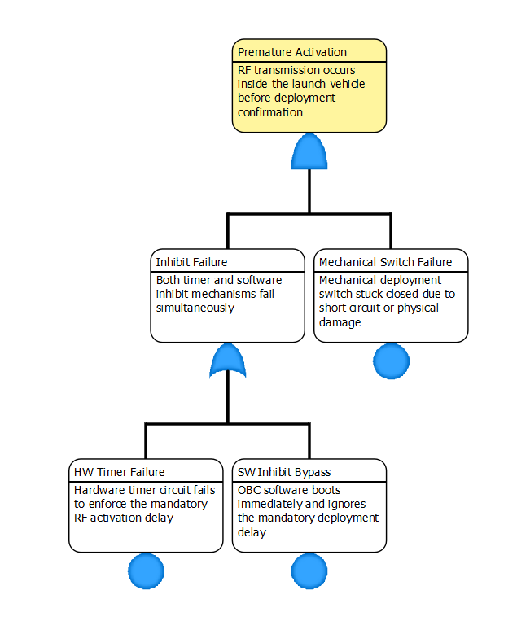

**Top Event:** Premature Activation — the satellite transmits RF signals while still inside the launch vehicle. This represents a critical safety hazard: it could interfere with launch vehicle navigation systems and would constitute a breach of the launch broker's safety requirements (Memo B, REQ10).

**Gate logic:** AND at the top level. Premature activation requires simultaneous failure of both the mechanical inhibit AND the timer/software inhibit. This reflects the deliberate multiple-inhibit design mandated by REQ10: no single point of failure can cause premature RF activation. This gate structure directly validates the architectural decision to implement independent, layered inhibit mechanisms.

**Mechanical Switch Failure (Basic Event, left branch):**
The physical deployment switch short-circuits or sticks closed, removing the first hardware inhibit layer. This is an independent, software-unrelated failure.

**Inhibit Failure – Timer and Software inhibit failure** (OR gate):
- *Hardware timer circuit failure* — the dedicated hardware timer fails to enforce the mandatory RF activation delay (on the order of tens of minutes, per Memo B); this is the second independent inhibit layer
- *OBC boots immediately and ignores mandatory deployment delay* — a software fault causes the OBC to skip the deployment delay sequence on boot, removing the software inhibit

---

### FT4 – Persistent System Freeze

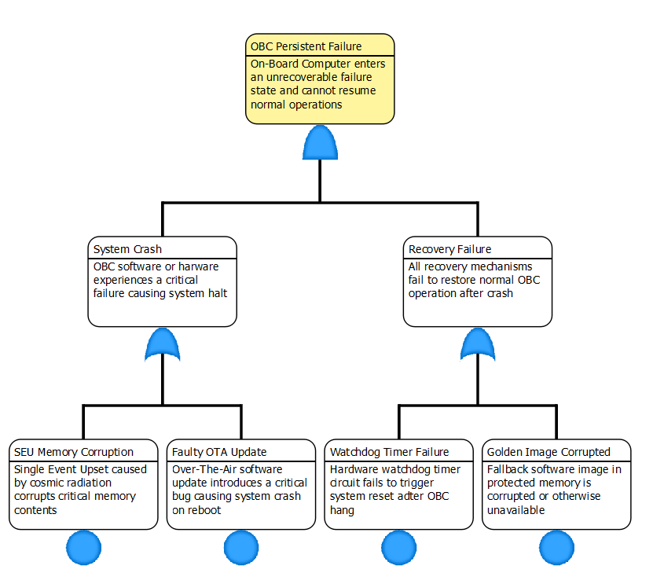

**Top Event:** OBC Persistent Failure — the On-Board Computer enters an unrecoverable failure state. Since the OBC controls all other functional blocks (Command & Control, mode management, watchdog supervision), its persistent failure effectively renders the satellite inoperable.

**Gate logic:** AND at the top level. A persistent (unrecoverable) failure requires both a system crash AND failure of all recovery mechanisms. If only the OBC crashes, the watchdog timer resets it and the golden image restores a working software state. If only the recovery mechanisms are degraded but the OBC keeps running, there is no impact. Both must fail simultaneously — this justifies the redundant recovery architecture described in REQ13 (watchdog + golden image fallback).

**System Crash** (OR gate):
- *SEU causing memory corruption* — cosmic radiation causes a Single Event Upset that corrupts a critical memory region, causing the OBC software to crash or enter an undefined state; a well-known risk in LEO over multi-year missions, and the primary motivation for the watchdog timer design
- *Faulty OTA software update* — an over-the-air software update introduces a critical bug that causes the system to crash on reboot; directly motivates REQ16.1 (automatic rollback to a working configuration if an update fails)

**Recovery Failure** (OR gate):
- *Hardware Watchdog Timer fails to reset the system* — the watchdog timer hardware circuit itself fails and cannot trigger the reset pulse after an OBC hang; this is the last hardware defence line
- *Fallback memory (Golden image) corrupted or unavailable* — the protected fallback software image in non-volatile memory is corrupted or inaccessible; if this occurs together with the watchdog failure, no recovery path remains

---

## Engineering Assumptions

The following assumptions were made during architectural design. All assumptions are documented and traceable within the model.

| # | Assumption | Basis |
|---|-----------|-------|
| A1 | Receiver duty cycle: 10–50% of each orbital period (~9–10 min/orbit at 25%) | Memo I |
| A2 | Daily downlink capacity: a few MB (19.2 kbps, ~70% effective throughput, ~3 passes/day, 5–10 min each) | Memo I, D |
| A3 | Onboard storage sized for at least 72 hours of message accumulation without a successful downlink | Memo I |
| A4 | Passive atmospheric drag is the accepted deorbit mechanism at end of life in LEO | Memo C |
| A5 | Hardware redundancy is not implemented; software-based recovery is used (watchdog reset, SW fallback) | Memo A, E |
| A6 | Total hardware budget is on the order of €200 000; individual subsystem costs are €5 000–€40 000 | Memo A |
| A7 | Eclipse duration: approximately 30–40 minutes per 95-minute orbit | Memo G |
| A8 | Ground passes: approximately 2–4 per day, each providing 5–10 minutes of usable link time | Memo D |
| A9 | RF transmission is inhibited for several tens of minutes following deployment confirmation | Memo B |
| A10 | Battery deep discharge limit: 20% state of charge; below this level the EPS shall shed non-essential loads | Memo E |
| A11 | For easier modeling, we assume, that every signal goes through the CAN bus.

